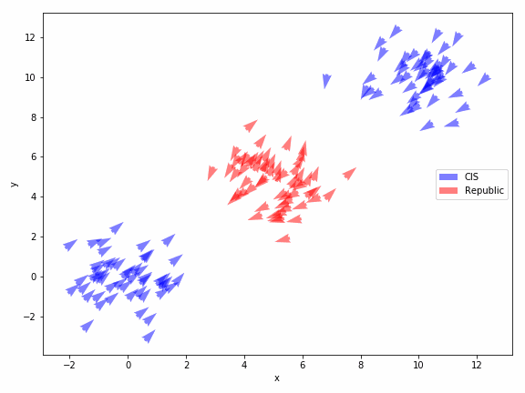

# `battlesim` 0.3.4: Modelling and animating simulated battles between units in Python.

The aim of this side project is to become familiar with Python classes and with primitive forms of animation and simulating environments. We map units onto a 2D plane and run simple simulations that involve them moving towards an enemy unit and attacking it. Rounds finish when one team has completely wiped out the other side, or we have reached the maximum number of timesteps.



The code for the primary engine is found in `battlesim/`, and implementations/examples are found in the Jupyter notebooks. Animations should display properly in these notebooks.

## Installation

`battlesim` requires the following dependencies:

* Python (>=3.5)
* NumPy (>=1.11.0)
* SciPy (>=1.3)
* Pandas (>=0.25.1)
* Matplotlib (>=3.1.1)
* Numba (>=0.45)

With the following for exporting the animation as a gif:

* ffmpeg

With the following for testing:

* PyTest (5.1.2)

If you have working versions of the dependencies, similarly install using `pip`:

```bash
pip install battlesim
```

## How to use: The Basics

Firstly, check the requirements for using this simulator, of which most come with the **Anaconda** distribution. In addition you will need the **ffmpeg** video conversion package to generate the simulations as animations.

Secondly, you will need to import the package as:

```python
>>> import battlesim as bsm
```

We recommend using `bsm` as a shorthand to reduce the amount of writing out you have to do. If you're using Jupyter notebook we also recommend:

```python
>>> import matplotlib.pyplot as plt
>>> plt.rcParams["animation.html"] = "html5"
>>> %matplotlib inline
```

The second line is important when you come to plotting the animations, as there are a number of issues with using it. All of the heavy lifting comes in the `bsm.Battle` object that provides a neat interface for all of the operations you would like to conduct:

```python
>>> import battlesim as bsm
>>> battle = bsm.Battle("datasets/starwars-clonewars.csv")
>>> battle
bsm.Battle(init=False)
```

You can see that we have specified a 'dataset' from which all of the unit roster can be drawn from; for specifics of how this file should
be oriented, see the documentation. We then need to specify units to create to form an army. For example, in this Star Wars example, we could specify a play-off between Clone troopers and B1 battledroids:

```python
>>> battle.create_army([("B1 battledroid", 70), ("Clone Trooper", 50)])
bsm.Battle(init=True, n_armies=2, simulated=False)
```

Here we call the `create_army` function, which internally creates an efficient `numpy` matrix, ready to perform the simulation. This is stored in the `battle.M_` object, a heterogenous `ndarray` element. From here, we might also want to specify the locations of our different blobs, as by default they will be sitting on top of each other at (0, 0).

```python
>>> battle.apply_position([dict(name="normal", x_loc=10), dict(name="normal", loc=0)])
bsm.Battle(init=True, n_armies=2, simulated=False)
```

Here the first element of each tuple represents the mean of the gaussian distribution, and the second element refers to the variance (or spread). From here, all we need to do now is simulate this:

```python
>>> F = battle.simulate()
```

By default, the simulation function will make a record of important parameters at each step and then return these parameters as a `pandas.DataFrame` at the end in *long form* (with a cached element called `sim_`). In addition, because you want to see what's going on - we can animate the frames using this convenience method within the battle object:

```python
>>> battle.sim_jupyter()
```


Here `sim_jupyter` treats each unit object as a quiver arrow in 2-d space (position and direction facing it's enemy). The targets should move towards each other and attempt to kill each other. Dead units are represented as crosses **'x'** on the map. 


The rest is for you to explore, tweak and enjoy watching arrows move towards each other and kill each other.

## One step further: Repeated runs

If you're interested in seeing how each team fare over multiple runs (to eliminate random biases), then `bsm.Battle` objects once defined, contain a `simulate_k()` method, where `k` specifies the number of runs you wish to complete. Unlike `simulate()` by itself, it does not return a `pandas.DataFrame` of frames, but rather the number of units from each team left standing at each iteration.

```python
>>> runs = battle.simulate_k(k=40)
```

This is the beginning of creating an interface similar to Machine Learning, whereby the outcome can be a classification (team) or regression (number of units surviving) target, and the unit compositions, aspects of the engine etc., can be inputs.


## Teaching series

As well as a fully-fledged package simulator, you can find teaching material in Jupyter notebook form within the `teaching/` subfolder, that takes users through the development process of this package, compares and contrasts Object-Oriented (OO) implementations to numpy-esque implementations, their performance, plotting, animations and more. We hope you find this material interesting and will aid as you use the package and possibly develop packages of your own in the future.

Material covered so far:

1. Basics, including importing the dataset, the `Unit` class, basic simulation
2. Improving the `Unit` class and simulation early-stopping for performance.
3. Plotting simulations and performance-driven development

This is still in active development retracing the steps of the project. All legacy functions associated with this can be found in the `battlesim/legacy.py` document.

## Future plans

* Developing height as a factor, using contours to impair movement speed and/or accuracy, range of fights. 
* Include AI-based behavior that makes use of height (to occupy hills)
* Include AI-based behavior that 'micros' or does hit-and-run against enemy units that are slower/less range.

***

Ensure that any use of this material is appropriately referenced and in compliance with the license.