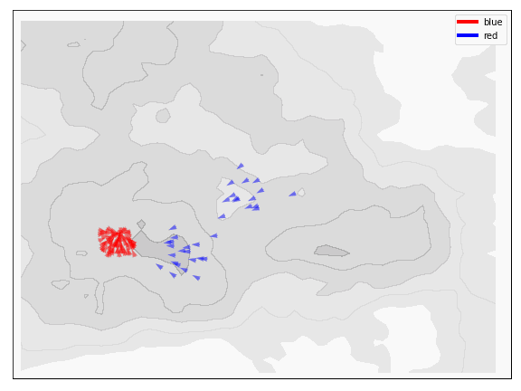

.. -* mode: rst -*-

battlesim: Modelling and animating simulated battles between units in Python.
=============================================================================

|pypi|_ |last_commit|_ |repo_size|_ |replit|_

.. |pypi| image:: https://img.shields.io/pypi/v/battlesim
.. _pypi: https://img.shields.io/pypi/v/battlesim

.. |last_commit| image:: https://img.shields.io/github/last-commit/gregparkes/BattleSimulator
.. _last_commit: https://img.shields.io/github/last-commit/gregparkes/BattleSimulator

.. |repo_size| image:: https://img.shields.io/github/repo-size/gregparkes/BattleSimulator
.. _repo_size: https://img.shields.io/github/repo-size/gregparkes/BattleSimulator

.. |replit| image:: https://repl.it/badge/github/gregparkes/BattleSimulator
.. _replit: https://repl.it/github/gregparkes/BattleSimulator

Want to watch arrows move and attack each other? Then look no further than this 
**BattleSimulator** we provide! Users familiar with 
`Totally Accurate Battle Simulator <https://steamcommunity.com/app/508440>`__
will hopefully love this package as a lot of the basic ideas are derived from this.

Main Features
-------------

Here are just a few things that ``battlesim`` aims to do well:

    - Formulate your simulation in a few lines of code from scratch.
    - Scales up to thousands (and 10s of thousands) of units
    - Flexibility: unit values are taken from a data file with flexible AI options
    - Performance: Just-in-time compiling (JIT) can manage thousands of units
    - Visualisation: Animations can be customized to change look-and-feel

Installation
------------

``battlesim`` requires the following `dependencies <environment.yml>`__:

- python (>= 3.8)
- numpy (>= 1.11.0)
- pandas (>= 0.25.1)
- matplotlib (>= 3.1.1)
- numba (>= 0.45)

With the following for exporting the animation as a gif:

- ffmpeg (>=4.2)

The following packages are not required but significantly improve the usage of this package.
If you are unfamiliar with the Jupyter project see `here <https://jupyter.org/>`__:

- jupyter (1.0.0)

From PyPI (Legacy)
~~~~~~~~~

If you have working versions of the dependencies, similarly install
using `pip <https://pypi.org/project/battlesim/>`__ (version 0.3.7)::

    pip install battlesim

We recommend updating the dependencies yourself using conda 
rather than through pip because conda manages the dependencies
better, but pip will do it for you. See the ``environment.yml`` 
file for dependencies.

From Cloning the GitHub Repository
~~~~~~~~~~~~~~~~~~~~~~~~~~~~~~~~~~

Alternatively if you are cloning this 
`GitHub repository <https://github.com/gregparkes/BattleSimulator>`__, use::

    git clone https://github.com/gregparkes/BattleSimulator
    conda env create -f environment.yml
    conda activate bsm

Now within the ``bsm`` environment run your Jupyter notebook::

    jupyter notebook

Running Tests
~~~~~~~~~~~~~

You will need the following for testing (soft requirement):

- PyTest (5.1.2)

Then perform the following within a console::

    cd tests/
    pytest -v

How to use: The Basics
----------------------

Firstly, check the requirements for using this simulator, of which most come
with the `Anaconda distribution <https://www.anaconda.com/>`__.
In addition you will need the **ffmpeg** video conversion package to generate
the simulations as animations.

Secondly, you will need to import the package as:

.. code-block:: python

    import battlesim as bsm

We recommend using ``bsm`` as a shorthand to reduce the amount of writing out you
have to do. If you're using Jupyter notebook we also recommend:

.. code-block:: python

    import matplotlib.pyplot as plt
    plt.rcParams["animation.html"] = "html5"

The second line is important when you come to plotting the animations, as there
are a number of issues with using it. All of the heavy lifting comes in the
``bsm.Battle`` object that provides a neat interface for all of the operations
you would like to conduct:

.. code-block:: python

    bat = bsm.Battle("datasets/starwars-clonewars.csv")

You can see that we have specified a 'dataset' from which all of
the unit roster can be drawn from; for specifics of how this file should
be oriented, see the documentation. We then need to specify 
units to create to form an army. For example, in this Star Wars 
example, we could specify a play-off between Clone troopers 
and B1 battledroids.

This is achieved using a meta-information object called a ``Composite``, which holds
a group of units of a given type:

.. code-block:: python

    armies = [
        bsm.Composite("B1 battledroid", 70),
        bsm.Composite("Clone Trooper", 50)
    ]
    bat.create_army(armies)

which internally creates an efficient numpy matrix, 
ready to perform the simulation. This is stored in the ``battle.M_``
object, a heterogenous ``ndarray`` element. By default, each Composite spawns
on top of each other using a gaussian distribution at (0, 0). When initialising
the Composite we can specify a new sampling using the ``Sampling`` class or
override directly:

.. code-block:: python

    bat.composition_[1].pos = bsm.Sampling("normal", 10., 2.)

And now to simulate (note that the first time this executes will be painfully slow
as JIT compiles a lot of code):

.. code-block:: python

    F = bat.simulate()

By default, the simulation function will make a record of
important parameters at each step and then return these 
parameters as a heterogenous ``ndarray`` at the end 
in *long form* (with a cached element called ``sim_``). 
In addition, because you want to see what's going on - we can 
animate the frames using this convenience method within
the Battle object:

.. code-block:: python

    bat.sim_jupyter()

The result is as follows.

.. image:: simulations/sim2.gif
    :alt: Image not Found
    :align: center

Here ``sim_jupyter`` treats each unit object as a quiver 
arrow in 2-d space (position and direction facing it's enemy).
The targets should move towards each other and attempt to kill
each other. Dead units are represented as crosses **'x'** on the map. 

.. image:: images/quiver1.svg
    :alt: Image not found
    :align: center

The rest is for you to explore, tweak and enjoy watching arrows
move towards each other and kill each other. We have 
extensive `examples <https://github.com/gregparkes/BattleSimulator/tree/master/examples>`__
to look at within this repository.

One step further: Repeated runs
-------------------------------

If you're interested in seeing how each team fare over
multiple runs (to eliminate random biases), then ``bsm.Battle``
objects once defined, contain a ``simulate_k()`` method, 
where ``k`` specifies the number of runs you wish to complete.
Unlike ``simulate()`` by itself, it does not 
return a ``ndarray`` of frames, but rather the 
number of units from each team left standing at each iteration:

.. code-block:: python

    runs = battle.simulate_k(k=40)

This is the beginning of creating an interface similar 
to Machine Learning, whereby the outcome can be a 
classification (team) or regression 
(number of units surviving) target, and the unit 
compositions, aspects of the engine etc., can be inputs.

New in v0.3.6
-------------

There are a number of exciting changes in this `current update <CHANGELOG.md>`__, including:

- Introduction of **Terrains**. This is a major expansion giving 3D pseudodepth to animated battles. Depth now influences movement speed of units, with terrain penalties applied (up to 50%) on higher hills. They also increase range for units on hills and increase damage when firing downhill on an enemy unit.
- Introduction of *armor*. Armor acts as another health buffer to protect units from harm.

Teaching series
---------------

As well as a fully-fledged package simulator, you can find
`teaching material <https://github.com/gregparkes/BattleSimulator/tree/master/teaching>`__ in Jupyter 
notebook form within the ``teaching/`` subfolder, that takes 
users through the development process of this package, compares
and contrasts Object-Oriented (OO) implementations to numpy-esque 
implementations, their performance, plotting, animations and more. 
We hope you find this material interesting and will aid as you use 
the package and possibly develop packages of your own in the future.

Material covered so far:

1. Basics, including importing the dataset, the ``Unit`` class, basic simulation
2. Improving the ``Unit`` class and simulation early-stopping for performance.
3. Plotting simulations and performance-driven development

This is still in active development retracing the steps of the project.
All legacy functions associated with this can be found in the *battlesim/legacy.py* document.

Future plans
------------

* Include AI-based behavior that makes use of height (to occupy hills)
* Develop 'defensive' AI.

Ensure that any use of this material is appropriately referenced 
and in compliance with the `license <LICENSE.txt>`__.